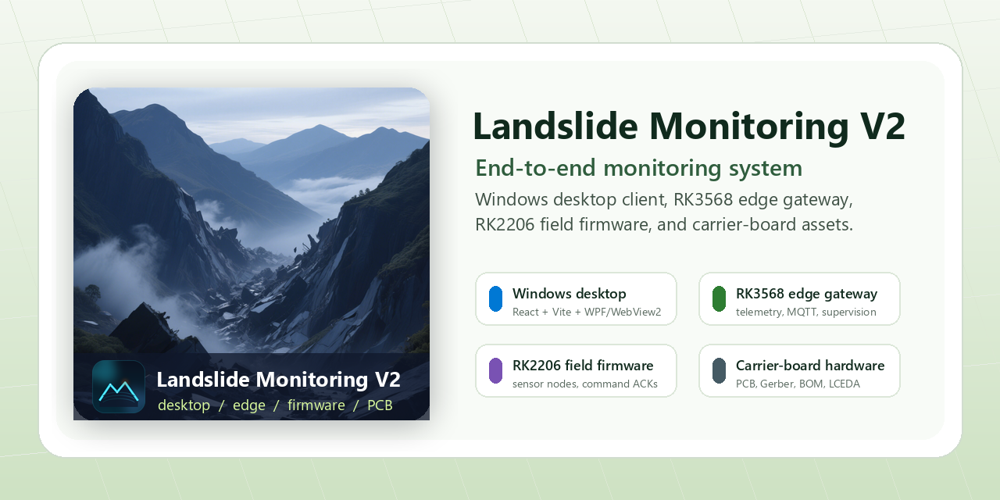

# Landslide Monitoring V2

[](https://github.com/kipp7/landslide-monitoring-v2/actions/workflows/ci.yml)
[](LICENSE)
[](apps/windows-shell)
[](edge/rk3568-gateway)
[](firmware/rk2206-xl01)
[](hardware/carrier-board)

English | [简体中文](README.zh-CN.md)

<p align="center">
  
</p>

Landslide Monitoring V2 is an end-to-end open-source landslide monitoring system. It brings together the Windows operator client, cloud backend services, RK3568 edge gateway services, RK2206 field-node firmware, and carrier-board hardware handoff assets in one public repository.

The repository is organized around five product areas: desktop operations, cloud backend services, edge gateway services, field firmware, and carrier-board hardware.

## System Overview

```text
RK2206 field nodes
  -> RK3568 edge gateway
    -> compatible monitoring API / MQTT broker
      -> Windows desktop operator client
```

## Highlights

- Windows monitoring client built with React, Vite, WPF, and WebView2.
- Cloud backend with REST API, PostgreSQL, ClickHouse, EMQX, Kafka, telemetry ingestion, rules, and device-command workers.
- RK3568 edge services for serial telemetry, MQTT forwarding, local health summaries, supervision, and alarm actuation.
- RK2206 XL01 field firmware package for sensor acquisition, telemetry envelopes, command acknowledgements, watchdogs, and board utilities.
- Carrier-board public handoff package with schematic, PCB preview, Gerber, BOM, pick-and-place, and LCEDA source package.
- Bilingual documentation, GitHub issue templates, maintainer notes, security policy, CI, and MIT license.

## Repository Layout

| Path | Responsibility |
| --- | --- |
| `apps/desktop-ui/` | React + Vite monitoring interface for operator workflows. |
| `apps/windows-shell/` | WPF + WebView2 Windows host, packaging assets, and native startup checks. |
| `services/` | Cloud API, telemetry, alerting, prediction, and command-processing services. |
| `infra/compose/` | Single-host backend infrastructure and application deployment. |
| `edge/rk3568-gateway/` | RK3568 gateway, link-monitor, supervisor, and alarm actuator services. |
| `firmware/rk2206-xl01/` | RK2206 XL01 field-node firmware package and pinout notes. |
| `hardware/carrier-board/` | Public carrier-board design and fabrication handoff assets. |
| `packages/`, `libs/` | Shared TypeScript packages used by edge and backend services. |
| `scripts/desktop/` | Windows desktop development, packaging, and verification scripts. |
| `docs/` | Architecture, scope, release, system, maintainer, and bilingual documentation. |

## Maintained Surfaces

| Surface | Status | Primary Docs |
| --- | --- | --- |
| Windows desktop client | Maintained | [Desktop UI](apps/desktop-ui/README.md), [Windows shell](apps/windows-shell/README.md) |
| Cloud backend | Maintained | [Docker Compose deployment](infra/compose/README.md) |
| RK3568 edge gateway | Maintained | [Edge gateway](edge/rk3568-gateway/README.md) |
| RK2206 field firmware | Maintained as public firmware package | [Firmware](firmware/rk2206-xl01/README.md) |
| Carrier-board hardware handoff | Maintained as public design package | [Hardware](hardware/carrier-board/README.md) |
| Web and mobile applications | Not included in the public tree | [Project scope](docs/PROJECT_SCOPE.md) |

## Tech Stack

| Layer | Technology |
| --- | --- |
| Desktop UI | React 18, TypeScript, Vite, Ant Design |
| Visualization | ECharts, Leaflet, Three.js |
| Native desktop shell | .NET 8, WPF, WebView2 |
| Cloud backend | Node.js 20, Fastify, PostgreSQL, ClickHouse, EMQX, Kafka |
| Edge services | Node.js 20, TypeScript, MQTT, serialport, systemd deployment templates |
| Field firmware | OpenHarmony/RK2206 application package |
| Hardware handoff | Schematic, PCB preview, Gerber, BOM, pick-and-place, LCEDA project package |
| Tooling | npm workspaces, ESLint, Prettier, GitHub Actions |

## Quick Start

```powershell
git clone https://github.com/kipp7/landslide-monitoring-v2.git
cd landslide-monitoring-v2
npm install
npm run dev
```

The desktop UI dev server starts at `http://localhost:5174/`.

Launch the native Windows shell against the dev server:

```powershell
npm run desktop:dev
```

## Build And Validate

Desktop UI:

```powershell
npm audit
npm run lint
npm run build
```

RK3568 edge services:

```powershell
npm run edge:build
npm run edge:lint
```

Windows shell:

```powershell
dotnet build .\apps\windows-shell\LandslideDesk.Win\LandslideDesk.Win.csproj -c Release
```

Create the default Windows portable package:

```powershell
npm run desktop:publish
```

Default packaging outputs stay outside Git:

- `artifacts/windows/portable/`
- `docs/reports/windows-package-latest.json`

## Documentation

- [Documentation hub](docs/README.md)
- [System overview](docs/system/OVERVIEW.md)
- [Architecture](docs/ARCHITECTURE.md)
- [Project scope](docs/PROJECT_SCOPE.md)
- [Release process](docs/RELEASE.md)
- [中文文档总览](docs/zh-CN/README.md)
- [中文系统概览](docs/zh-CN/system/OVERVIEW.md)
- [中文架构说明](docs/zh-CN/ARCHITECTURE.md)
- [中文项目范围](docs/zh-CN/PROJECT_SCOPE.md)
- [中文发布流程](docs/zh-CN/RELEASE.md)

## Repository Scope

This repository includes public source code, documentation, examples, deployment templates, the RK2206 firmware package, and carrier-board handoff files. Runtime secrets, local logs, generated builds, and site-specific configuration should stay outside Git.

## Contributing

Contributions are welcome. Please read [CONTRIBUTING.md](CONTRIBUTING.md) before opening a pull request, and include screenshots or recordings for visible UI changes.

## License

Released under the [MIT License](LICENSE).
