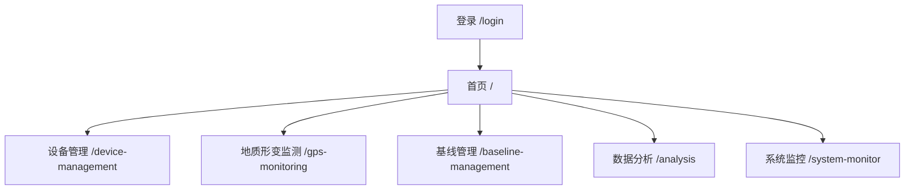
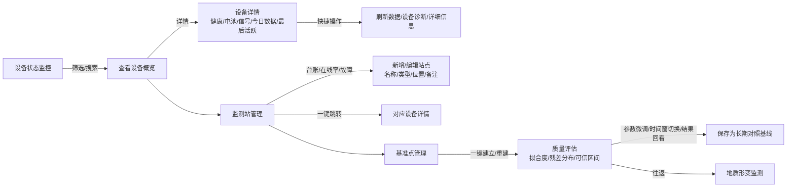
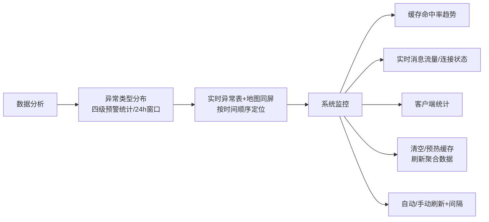
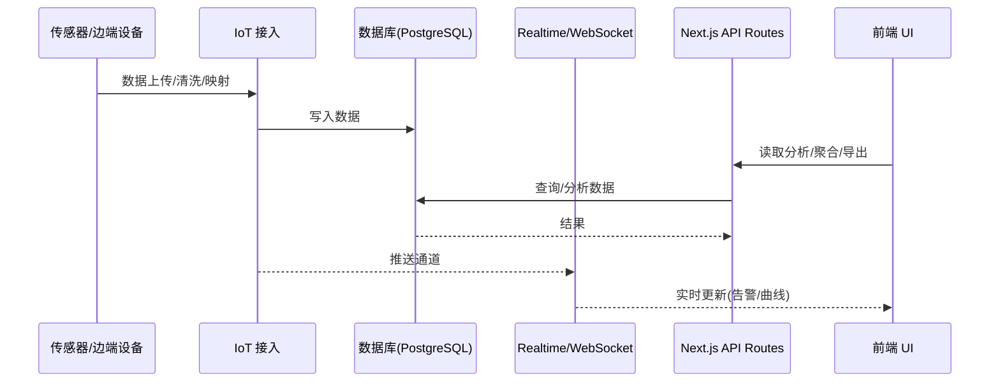

# Group 7 交互流程（Mermaid，可直接打印为 PDF）

> 用于第七组“数字媒体设计”提交。建议浏览器打印为 PDF：A4、窄边距、纵向；需要可选“背景图形”。

## 1. 站点地图（总览）


## 2. 模块一 · 设备管理（状态→监测站→基准点）


## 3. 模块二 · 地质形变监测（核心）
```mermaid
flowchart TB
  D0[设备/时间选择器\n自动刷新开关] --> D1[顶部卡片\n国标预警等级]
  D1 --> D2[数据质量面板\n置信度/评分]
  D2 --> D3{四大分栏}
  D3 --> D3A[实时监测]
  D3A --> D3A1[位移趋势\n总/水平/垂直\n智能刻度/高亮]
  D3A --> D3A2[形变速度\nmm/h 平滑/智能范围]
  D3A --> D3A3[环境因素关联\n温度/湿度双轴]
  D3 --> D3B[CEEMD 分解]
  D3B --> D3B1[IMF 分量时域图]
  D3B --> D3B2[IMF 主频谱]
  D3B --> D3B3[长期趋势(残差)]
  D3B --> D3B4[能量分布(占比)]
  D3B --> D3B5[分量数/信号长度/分解质量]
  D3 --> D3C[预测分析]
  D3C --> D3C1[短期预测(24h)\n历史窗口: 自适应/固定/智能]
  D3C --> D3C2[长期趋势(7d)\n平滑过渡可切换]
  D3C --> D3C3[预测误差评估 1h→7d\nMAE/R²/置信度→时间衰减]
  D3C --> D3C4[风险预警分析\n等级+关键因子(JSON保留)]
  D3 --> D3D[数据详情]
  D3D --> D3D1[统计概览\n数据量/最大/平均/跨度]
  D3D --> D3D2[位移分布直方图\n动态分组]
  D3D --> D3D3[明细表\n分页/排序]
  D3D --> D3D4[导出分析/综合报告\n强制刷新]
  D0 --> D4[设置/数据点数限制\n推荐 100–500 条]
  D3C --> E[基准点管理\n参数校准后回看预测]
```

## 4. 模块四 · 分析与系统监控（联动）


## 5. 端到端时序（IoT→数据层→前端）


## 6. PDF 导出建议
- 浏览器打印：Ctrl/Cmd+P → 目标选“保存为 PDF” → A4、纵向、窄边距。
- 含代码渲染：若本地不支持 Mermaid 预览，可用 VSCode 插件 “Markdown Preview Mermaid Support” 预览后打印。
- 页眉题注：建议在第一页添加作品名“山稳数境 | Mountain Insight”。
